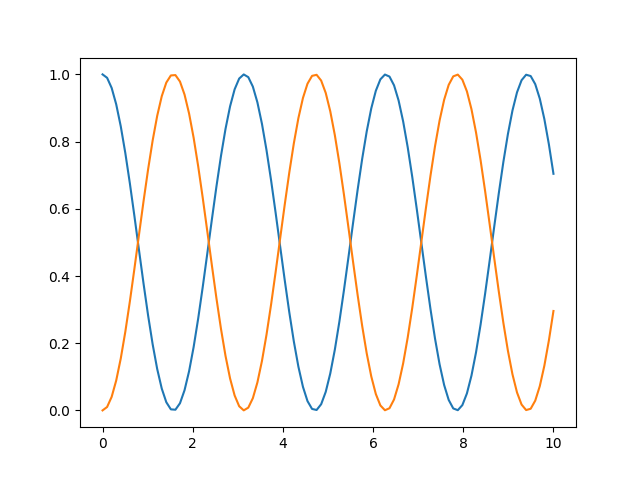

# Tutorials

La rutina de rk4 es bastante útil. Una de sus posibles aplicaciones, es observar la evolución temporal de un estado $\textbf{y} (\textit{t})$. Esto se podría hacer empleando la función solo una vez; sin embargo, para mayor precisión, se puede dividir el tiempo transcurrido en muchos lapsos pequeños y homogéneos de tiempo. Luego, guardar cada estado obtenido en un arreglo y por último graficar para ver la forma en la que varía. Además, se puede graficar tomando como punto de partida un estado diferente, para compararlos y ver qué tanto afecta. Un ejemplo de cómo podría aplicarse esto es de la siguiente forma:

```python
import numpy as np  #se importa la biblioteca numpy ya que la vamos a ocupar para ciertos cálculos.

oOper = np.array([[0,1], [1,0]]) #se define el operador con el que vamos a trabajar.
yInit = np.array([[1,0], [0,0]]) #se define un estado inicial.

def dyn_generator(oper, state):
    return -1.0j * (np.dot(oper, state) - np.dot(state, oper)) #esta función es la que evalúa la dinámica a partir del operador y el estado.

def rk4(func, oper, state, h):
    k_1 = func(oper, state)
    k_2 = func(oper, state + h*(k_1)/2)
    k_3 = func(oper, state + h*(k_2)/2)
    k_4 = func(oper, state + h*(k_3))
    return state + (1/6) * h * (k_1 + 2*k_2 + 2*k_3 + k_4) #esta es la función que aplica el método rk4. 

times = np.linspace(0, 10, 100) #aquí se crea un arreglo homogéneo de 100 tiempos entre 0 y 10.

h = times[1] - times[0] #calculamos el tiempo que pasa entre cada elemento del arreglo, esto se puede hacer con cualesquiera dos elementos seguidos, ya que la lista es homogenéa.

yCopy = yInit.copy() #se crea una copia del operador que representa el estado inicial.

stateQuant00 = np.zeros(times.size) #guardamos un arreglo que solo contiene 0.0 y que tiene el tamaño del arreglo times que se definió anteriormete
stateQuant11 = np.zeros(times.size) #se hace otro arreglo igual. Esto se hace para guardar dos entradas diferentes de la matriz del estado inicial, para luego compararlas.

for tt in range(times.size):
    stateQuant00[tt] = yInit[0,0].real #se guarda la parte real de la entrada (0,0) de la matriz del estado inicial.
    stateQuant11[tt] = yInit[1,1].real #se guarda la parte real de la entrada (1,1) de la matriz del estado inicial. 
    yN = rk4(dyn_generator, oOper, yInit, h) #se invoca la rutina rk4 actuando sobre el el estado inicial.
    yInit = yN #ahora se pone el estado obtenido anteriormente como el estado inicial, para que en la siguiente iteración se evalúe con respecto a él.

#Ahora, ya se tienen los valores del estado confome iba pasando el tiempo, con dos puntos iniciales diferentes. 

import matplotlib.pyplot as plt #se importa la libreria matplotlib.pyplot para hacer las gráficas

fig, ax = plt.subplots()
ax.plot(times, stateQuant00)
ax.plot(times, stateQuant11) #se hacen ambas gráficas, cuando el estado iniciaba en la entrada (0,0) de la matriz del estado inicial y cuando iniciaba en la entrada (1,1)
plt.show()
```
La gráfica de los estados con respecto al tiempo se ve de la siguiente manera:


